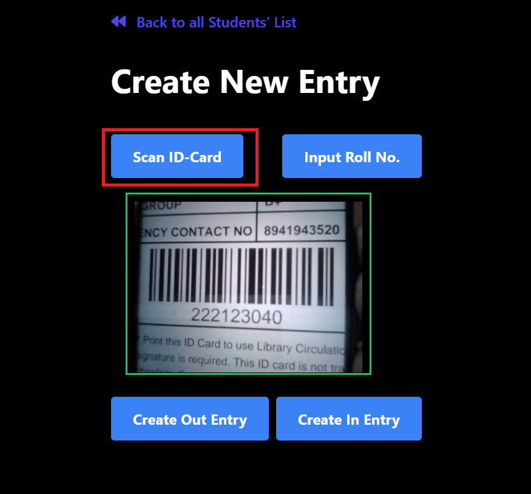

# IITG-Entry-Exit-System
A user-friendly website providing real-time monitoring of student’s entry and exit across various gates in IITG campus.

## Table of Contents
  - [Features](#features)
  - [Usage](#usage)
  - [Tech stack](#tech-stack)

## Features
Here is the overview of the features of the project. First we we have Entry creation page where student can create entry by Scanning barcode (ID card) or by roll number.

---

To create the entry by scanning ID card click on the button "Scan ID-Card"
It will ask for camera permission, after giving the permission, scan your ID card. It will directly fetch the details from the ID card.

---

After scanning the ID card. It will notify that "Barcode Scanned, Please create entry", Now click on respective button to create entry.

---

After entry creation a toast will appear on the top of the screen.

---

One can make an entry using roll number also.

---

Here is the Home page of the application where all the entries will appears.

---

Home page have several options for filter the entries such as "Exit Entries" to get the list of all the student who are currently out of the campus, "Filter by Date" to get the entries for a particular date.

## Usage

This application resolves the problem of manual data entries of students who are going outside or coming inside the campus. It also prevent false entries ensuring database integrity and minimizing discrepancies.

## Tech stack

---

